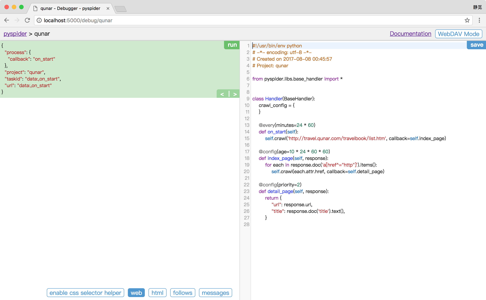
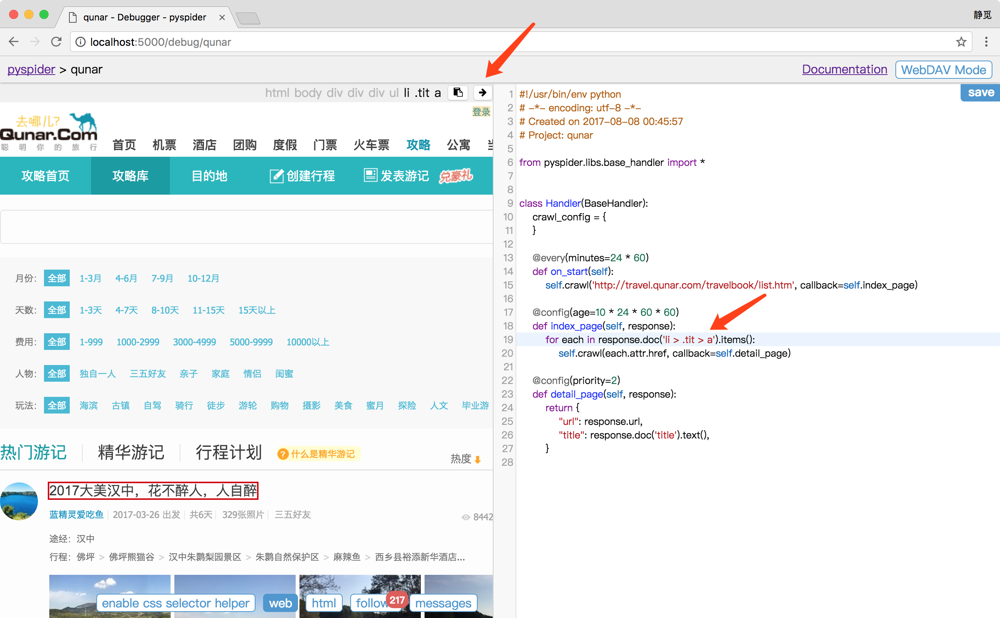
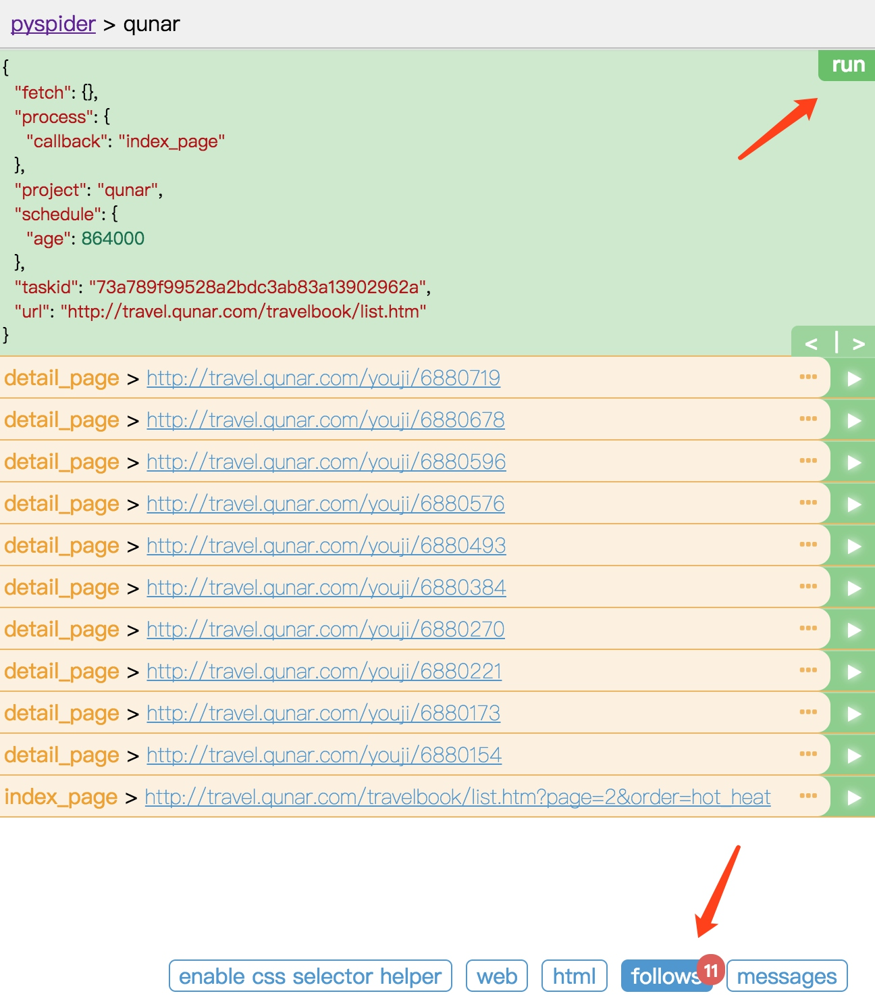
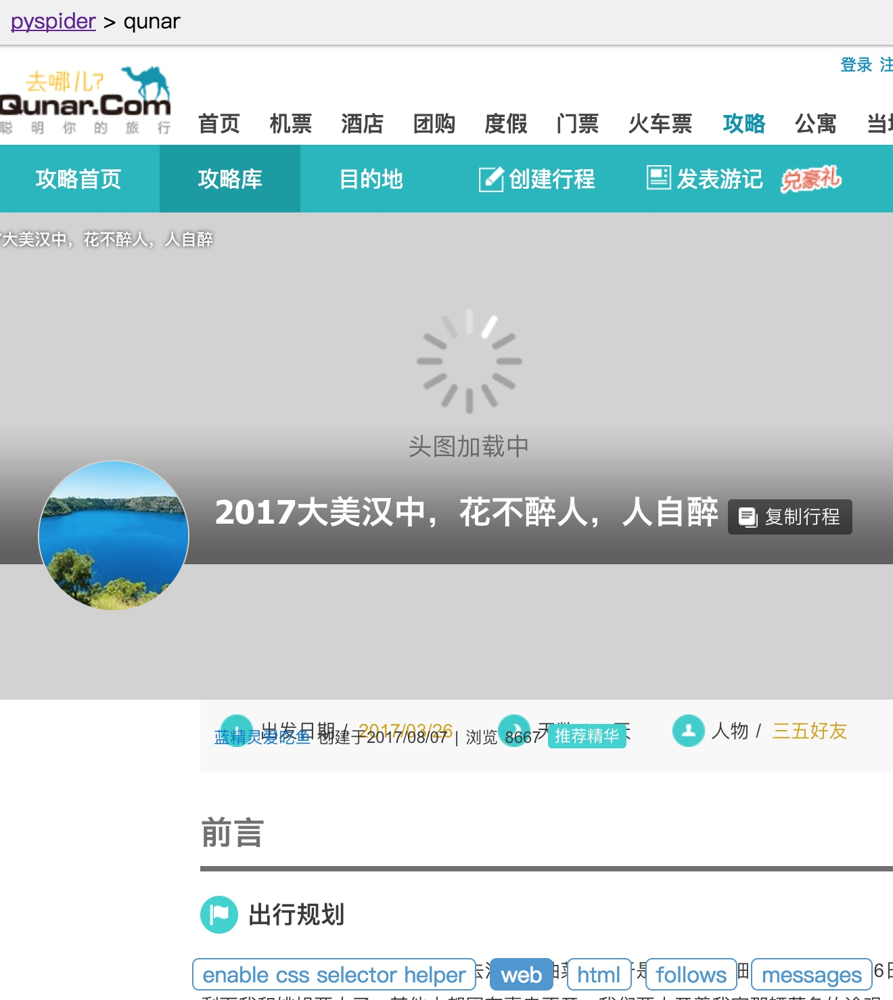
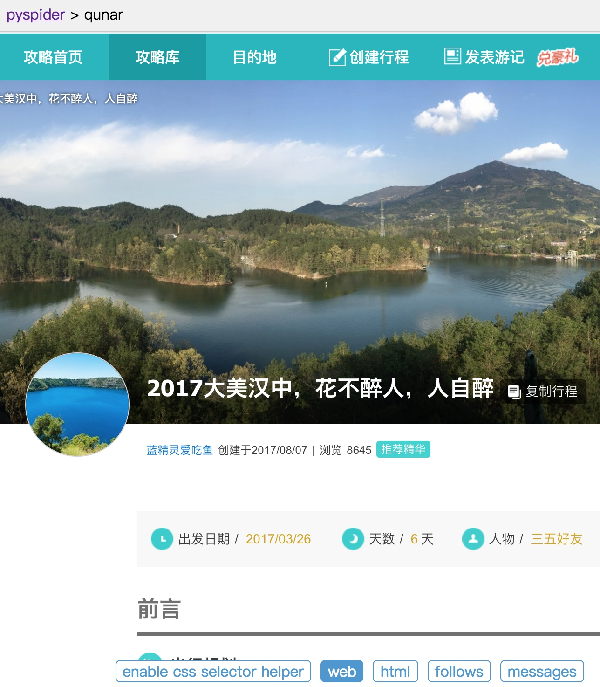
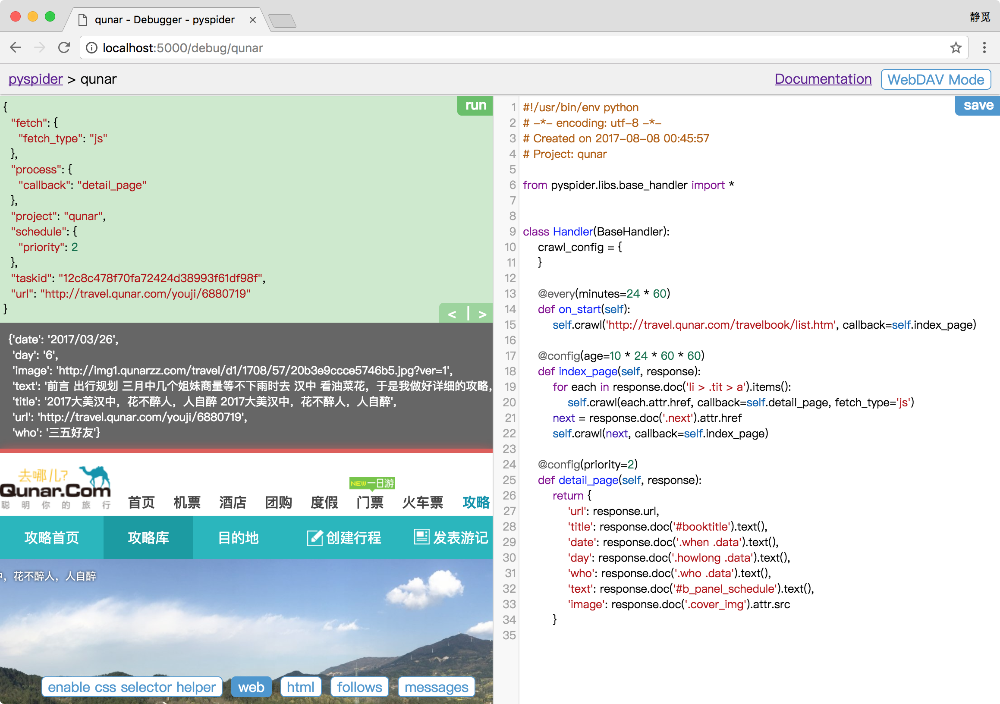
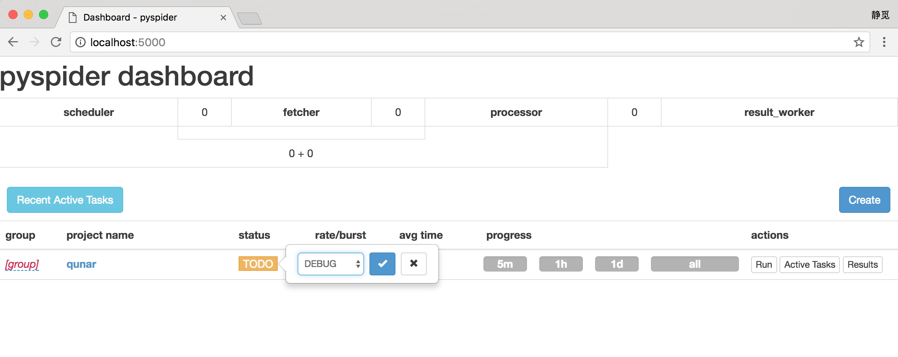

# 12.2 pyspider 的基本使用

本节用一个实例来讲解 pyspider 的基本用法。

### 1. 本节目标

我们要爬取的目标是去哪儿网的旅游攻略，链接为 http://travel.qunar.com/travelbook/list.htm，我们要将所有攻略的作者、标题、出发日期、人均费用、攻略正文等保存下来，存储到 MongoDB 中。

### 2. 准备工作

请确保已经安装好了 pyspider 和 PhantomJS，安装好了 MongoDB 并正常运行服务，还需要安装 PyMongo 库，具体安装可以参考第 1 章的说明。

### 3. 启动 pyspider

执行如下命令启动 pyspider：

```
pyspider all
```

运行效果如图 12-2 所示。


图 12-2 运行结果

这样可以启动 pyspider 的所有组件，包括 PhantomJS、ResultWorker、Processer、Fetcher、Scheduler、WebUI，这些都是 pyspider 运行必备的组件。最后一行输出提示 WebUI 运行在 5000 端口上。可以打开浏览器，输入链接 http://localhost:5000，这时我们会看到页面，如图 12-3 所示。


图 12-3 WebUI 页面

此页面便是 pyspider 的 WebUI，我们可以用它来管理项目、编写代码、在线调试、监控任务等。

### 4. 创建项目

新建一个项目，点击右边的 Create 按钮，在弹出的浮窗里输入项目的名称和爬取的链接，再点击 Create 按钮，这样就成功创建了一个项目，如图 12-4 所示。


图 12-4 创建项目

接下来会看到 pyspider 的项目编辑和调试页面，如图 12-5 所示。



图 12-5 调试页面

左侧就是代码的调试页面，点击左侧右上角的 run 单步调试爬虫程序，在左侧下半部分可以预览当前的爬取页面。右侧是代码编辑页面，我们可以直接编辑代码和保存代码，不需要借助于 IDE。

注意右侧，pyspider 已经帮我们生成了一段代码，代码如下所示：

```python
from pyspider.libs.base_handler import *

class Handler(BaseHandler):
    crawl_config = { }

    @every(minutes=24 * 60)
    def on_start(self):
        self.crawl('http://travel.qunar.com/travelbook/list.htm', callback=self.index_page)

    @config(age=10 * 24 * 60 * 60)
    def index_page(self, response):
        for each in response.doc('a[href^="http"]').items():
            self.crawl(each.attr.href, callback=self.detail_page)

    @config(priority=2)
    def detail_page(self, response):
        return {
            "url": response.url,
            "title": response.doc('title').text(),}
```

这里的 Handler 就是 pyspider 爬虫的主类，我们可以在此处定义爬取、解析、存储的逻辑。整个爬虫的功能只需要一个 Handler 即可完成。

接下来我们可以看到一个 crawl_config 属性。我们可以将本项目的所有爬取配置统一定义到这里，如定义 Headers、设置代理等，配置之后全局生效。

然后，on_start() 方法是爬取入口，初始的爬取请求会在这里产生，该方法通过调用 crawl() 方法即可新建一个爬取请求，第一个参数是爬取的 URL，这里自动替换成我们所定义的 URL。crawl() 方法还有一个参数 callback，它指定了这个页面爬取成功后用哪个方法进行解析，代码中指定为 index_page() 方法，即如果这个 URL 对应的页面爬取成功了，那 Response 将交给 index_page() 方法解析。

index_page() 方法恰好接收这个 Response 参数，Response 对接了 pyquery。我们直接调用 doc() 方法传入相应的 CSS 选择器，就可以像 pyquery 一样解析此页面，代码中默认是 a[href^="http"]，也就是说该方法解析了页面的所有链接，然后将链接遍历，再次调用了 crawl() 方法生成了新的爬取请求，同时再指定了 callback 为 detail_page，意思是说这些页面爬取成功了就调用 detail_page() 方法解析。这里，index_page() 实现了两个功能，一是将爬取的结果进行解析，二是生成新的爬取请求。

detail_page() 同样接收 Response 作为参数。detail_page() 抓取的就是详情页的信息，就不会生成新的请求，只对 Response 对象做解析，解析之后将结果以字典的形式返回。当然我们也可以进行后续处理，如将结果保存到数据库。

接下来，我们改写一下代码来实现攻略的爬取吧。

### 5. 爬取首页

点击左栏右上角的 run 按钮，即可看到页面下方 follows 便会出现一个标注，其中包含数字 1，这代表有新的爬取请求产生，如图 12-6 所示。


图 12-6 操作示例

左栏左上角会出现当前 run 的配置文件，这里有一个 callback 为 on_start，这说明点击 run 之后实际是执行了 on_start() 方法。在 on_start() 方法中，我们利用 crawl() 方法生成一个爬取请求，那下方 follows 部分的数字 1 就代表了这一个爬取请求。

点击下方的 follows 按钮，即可看到生成的爬取请求的链接。每个链接的右侧还有一个箭头按钮，如图 12-7 所示。


图 12-7 操作示例

点击该箭头，我们就可以对此链接进行爬取，也就是爬取攻略的首页内容，如图 12-8 所示。


图 12-8 爬取结果

上方的 callback 已经变成了 index_page，这就代表当前运行了 index_page() 方法。index_page() 接收到的 response 参数就是刚才生成的第一个爬取请求的 Response 对象。index_page() 方法通过调用 doc() 方法，传入提取所有 a 节点的 CSS 选择器，然后获取 a 节点的属性 href，这样实际上就是获取了第一个爬取页面中的所有链接。然后在 index_page() 方法里遍历了所有链接，同时调用 crawl() 方法，就把这一个个的链接构造成新的爬取请求了。所以最下方 follows 按钮部分有 217 的数字标记，这代表新生成了 217 个爬取请求，同时这些请求的 URL 都呈现在当前页面了。

再点击下方的 web 按钮，即可预览当前爬取结果的页面，如图 12-9 所示。


图 12-9 预览页面

当前看到的页面结果和浏览器看到的几乎是完全一致的，在这里我们可以方便地查看页面请求的结果。

点击 html 按钮即可查看当前页面的源代码，如图 12-10 所示。


图 12-10 页面源码

如果需要分析代码的结构，我们可以直接参考页面源码。

我们刚才在 index_page() 方法中提取了所有的链接并生成了新的爬取请求。但是很明显要爬取的肯定不是所有链接，只需要攻略详情的页面链接就够了，所以我们要修改一下当前 index_page() 里提取链接时的 CSS 选择器。

接下来需要另外一个工具。首先切换到 Web 页面，找到攻略的标题，点击下方的 enable css selector helper，点击标题。这时候我们看到标题外多了一个红框，上方出现了一个 CSS 选择器，这就是当前标题对应的 CSS 选择器，如图 12-11 所示。


图 12-11 CSS 工具

在右侧代码选中要更改的区域，点击左栏的右箭头，此时在上方出现的标题的 CSS 选择器就会被替换到右侧代码中，如图 12-12 所示。



图 12-12 操作结果

这样就成功完成了 CSS 选择器的替换，非常便捷。

重新点击左栏右上角的 run 按钮，即可重新执行 index_page() 方法。此时的 follows 就变成了 10 个，也就是说现在我们提取的只有当前页面的 10 个攻略，如图 12-13 所示。


图 12-13 运行结果

我们现在抓取的只是第一页的内容，还需要抓取后续页面，所以还需要一个爬取链接，即爬取下一页的攻略列表页面。我们再利用 crawl() 方法添加下一页的爬取请求，在 index_page() 方法里面添加如下代码，然后点击 save 保存：

```python
next = response.doc('.next').attr.href
self.crawl(next, callback=self.index_page)
```

利用 CSS 选择器选中下一页的链接，获取它的 href 属性，也就获取了页面的 URL。然后将该 URL 传给 crawl() 方法，同时指定回调函数，注意这里回调函数仍然指定为 index_page() 方法，因为下一页的结构与此页相同。

重新点击 run 按钮，这时就可以看到 11 个爬取请求。follows 按钮上会显示 11，这就代表我们成功添加了下一页的爬取请求，如图 12-14 所示。



图 12-14 运行结果

现在，索引列表页的解析过程我们就完成了。

### 6. 爬取详情页

任意选取一个详情页进入，点击前 10 个爬取请求中的任意一个的右箭头，执行详情页的爬取，如图 12-15 所示。


图 12-15 运行结果

切换到 Web 页面预览效果，页面下拉之后，头图正文中的一些图片一直显示加载中，如图 12-16 和图 12-17 所示。



图 12-16 预览结果


图 12-17 预览结果

查看源代码，我们没有看到 img 节点，如图 12-18 所示。


图 12-18 源代码

出现此现象的原因是 pyspider 默认发送 HTTP 请求，请求的 HTML 文档本身就不包含 img 节点。但是在浏览器中我们看到了图片，这是因为这张图片是后期经过 JavaScript 出现的。那么，我们该如何获取呢？

幸运的是，pyspider 内部对接了 PhantomJS，那么我们只需要修改一个参数即可。

我们将 index_page() 中生成抓取详情页的请求方法添加一个参数 fetch_type，改写的 index_page() 变为如下内容：

```python
def index_page(self, response):
    for each in response.doc('li> .tit > a').items():
        self.crawl(each.attr.href, callback=self.detail_page, fetch_type='js')
    next = response.doc('.next').attr.href
    self.crawl(next, callback=self.index_page)
```
接下来，我们来试试它的抓取效果。

点击左栏上方的左箭头返回，重新调用 index_page() 方法生成新的爬取详情页的 Request，如图 12-19 所示。


图 12-19 爬取详情

再点击新生成的详情页 Request 的爬取按钮，这时我们便可以看到页面变成了这样子，如图 12-20 所示。



图 12-20 运行结果

图片被成功渲染出来，这就是启用了 PhantomJS 渲染后的结果。只需要添加一个 fetch_type 参数即可，这非常方便。

最后就是将详情页中需要的信息提取出来，提取过程不再赘述。最终 detail_page() 方法改写如下所示：

```python
def detail_page(self, response):
    return {
        'url': response.url,
        'title': response.doc('#booktitle').text(),
        'date': response.doc('.when .data').text(),
        'day': response.doc('.howlong .data').text(),
        'who': response.doc('.who .data').text(),
        'text': response.doc('#b_panel_schedule').text(),
        'image': response.doc('.cover_img').attr.src
    }
```

我们分别提取了页面的链接、标题、出行日期、出行天数、人物、攻略正文、头图信息，将这些信息构造成一个字典。

重新运行，即可发现输出结果如图 12-21 所示。



图 12-21 输出结果

左栏中输出了最终构造的字典信息，这就是一篇攻略的抓取结果。

### 7. 启动爬虫

返回爬虫的主页面，将爬虫的 status 设置成 DEBUG 或 RUNNING，点击右侧的 Run 按钮即可开始爬取，如图 12-22 所示。



图 12-22 启动爬虫

在最左侧我们可以定义项目的分组，以方便管理。rate/burst 代表当前的爬取速率，rate 代表 1 秒发出多少个请求，burst 相当于流量控制中的令牌桶算法的令牌数，rate 和 burst 设置的越大，爬取速率越快，当然速率需要考虑本机性能和爬取过快被封的问题。process 中的 5m、1h、1d 指的是最近 5 分、1 小时、1 天内的请求情况，all 代表所有的请求情况。请求由不同颜色表示，蓝色的代表等待被执行的请求，绿色的代表成功的请求，黄色的代表请求失败后等待重试的请求，红色的代表失败次数过多而被忽略的请求，这样可以直观知道爬取的进度和请求情况，如图 12-23 所示。


图 12-23 爬取情况

点击 Active Tasks，即可查看最近请求的详细状况，如图 12-24 所示。


图 12-24 最近请求

点击 Results，即可查看所有的爬取结果，如图 12-25 所示。


图 12-25 爬取结果

点击右上角的按钮，即可获取数据的 JSON、CSV 格式。


本节介绍了 pyspider 的基本用法，接下来我们会更加深入了解它的详细使用。