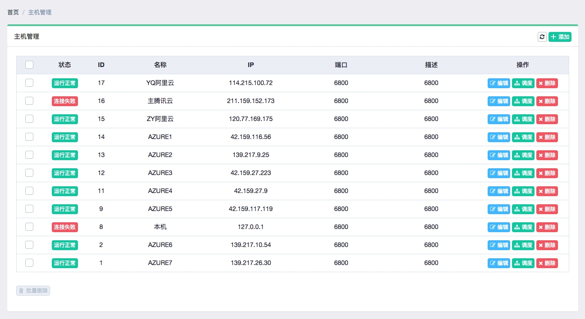
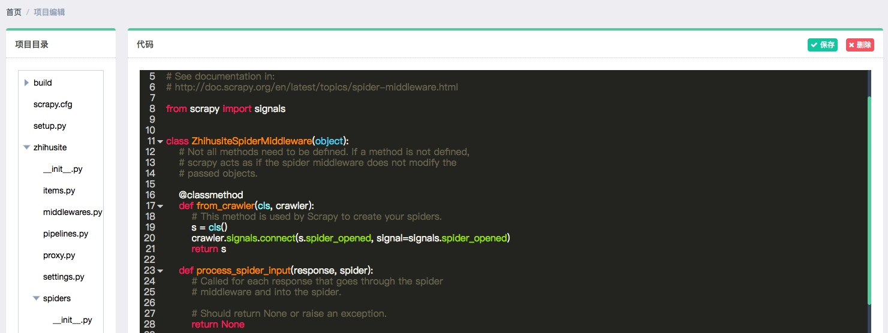
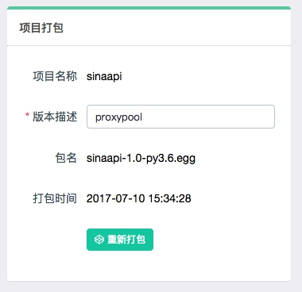
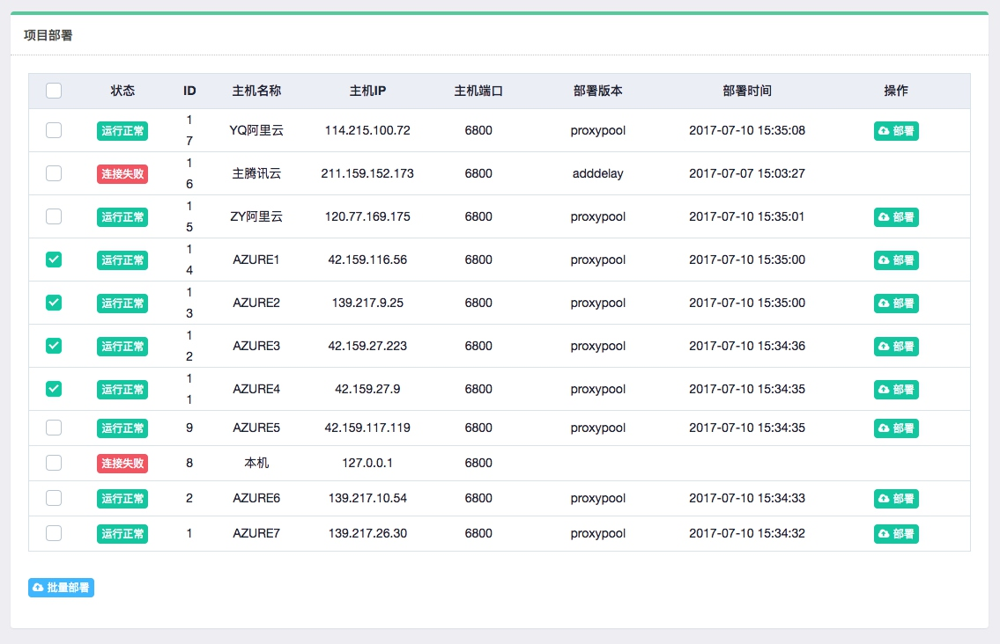
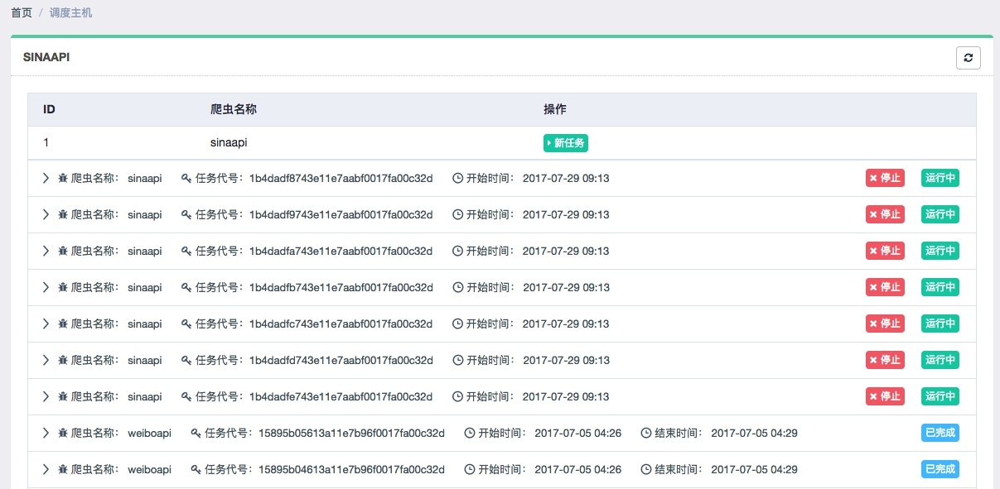
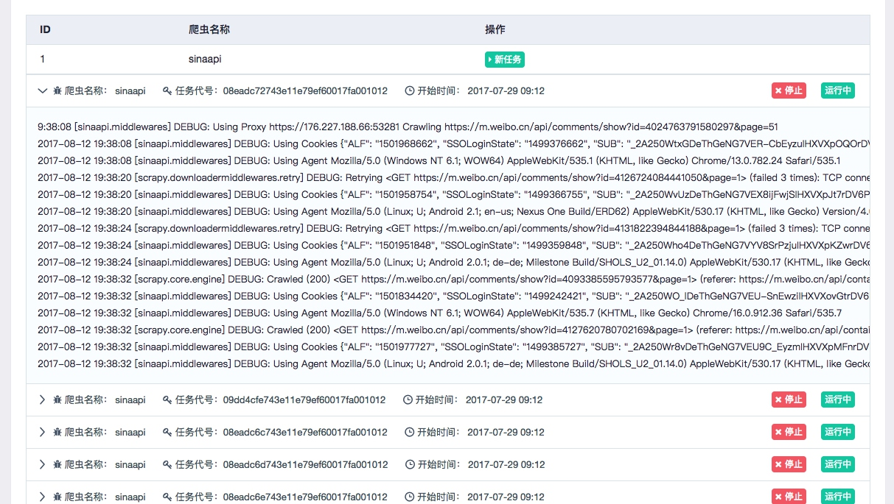

# 15.5 Gerapy 分布式管理

我们可以通过 Scrapyd-Client 将 Scrapy 项目部署到 Scrapyd 上，并且可以通过 Scrapyd API 来控制 Scrapy 的运行。那么，我们是否可以做到更优化？方法是否可以更方便可控？

我们重新分析一下当前可以优化的问题。

* 使用 Scrapyd-Client 部署时，需要在配置文件中配置好各台主机的地址，然后利用命令行执行部署过程。如果我们省去各台主机的地址配置，将命令行对接图形界面，只需要点击按钮即可实现批量部署，这样就更方便了。

* 使用 Scrapyd API 可以控制 Scrapy 任务的启动、终止等工作，但很多操作还是需要代码来实现，同时获取爬取日志还比较烦琐。如果我们有一个图形界面，只需要点击按钮即可启动和终止爬虫任务，同时还可以实时查看爬取日志报告，那这将大大节省我们的时间和精力。

所以我们的终极目标是如下内容。

* 更方便地控制爬虫运行
* 更直观地查看爬虫状态
* 更实时地查看爬取结果
* 更简单地实现项目部署
* 更统一地实现主机管理

而这所有的工作均可通过 Gerapy 来实现。

Gerapy 是一个基于 Scrapyd、Scrapyd API、Django、Vue.js 搭建的分布式爬虫管理框架。接下来将简单介绍它的使用方法。

### 1. 准备工作

在本节开始之前请确保已经正确安装好了 Gerapy，安装方式可以参考第一章。

### 2. 使用说明

首先可以利用 gerapy 命令新建一个项目，命令如下：

```
gerapy init
```

这样会在当前目录下生成一个 gerapy 文件夹，然后进入 gerapy 文件夹，会发现一个空的 projects 文件夹，我们后文会提及。

这时先对数据库进行初始化：

```
gerapy migrate
```

这样即会生成一个 SQLite 数据库，数据库中会用于保存各个主机配置信息、部署版本等。

接下来启动 Gerapy 服务，命令如下：

```
gerapy runserver
```

这样即可在默认 8000 端口上开启 Gerapy 服务，我们浏览器打开：[http://localhost:8000](http://localhost:8000) 即可进入 Gerapy 的管理页面，在这里提供了主机管理和项目管理的功能。

主机管理中，我们可以将各台主机的 Scrapyd 运行地址和端口添加，并加以名称标记，添加之后便会出现在主机列表中，Gerapy 会监控各台主机的运行状况并以不同的状态标识，如图 15-6 所示：



图 15-6 主机列表

另外刚才我们提到在 gerapy 目录下有一个空的 projects 文件夹，这就是存放 Scrapy 目录的文件夹，如果我们想要部署某个 Scrapy 项目，只需要将该项目文件放到 projects 文件夹下即可。

比如这里我放了两个 Scrapy 项目，如图 15-7 所示：


图 15-7 项目目录

这时重新回到 Gerapy 管理界面，点击项目管理，即可看到当前项目列表，如图 15-8 所示：


图 15-8 项目列表

由于此处我有过打包和部署记录，在这里分别予以显示。

Gerapy 提供了项目在线编辑功能，我们可以点击编辑即可可视化地对项目进行编辑，如图 15-9 所示：



图 15-9 可视化编辑

如果项目没有问题，可以点击部署进行打包和部署，部署之前需要打包项目，打包时可以指定版本描述，如图 15-10 所示：



图 15-10 项目打包

打包完成之后可以直接点击部署按钮即可将打包好的 Scrapy 项目部署到对应的云主机上，同时也可以批量部署，如图 15-11 所示：



图 15-11 部署页面

部署完毕之后就可以回到主机管理页面进行任务调度了，点击调度即可查看进入任务管理页面，可以当前主机所有任务的运行状态，如图 15-12 所示：



图 15-12 任务运行状态

我们可以通过点击新任务、停止等按钮来实现任务的启动和停止等操作，同时也可以通过展开任务条目查看日志详情，如图 15-13 所示：



图 15-13 查看日志

这样我们就可以实时查看到各个任务运行状态了。

以上便是 Gerapy 的一些功能的简单介绍，使用它我们可以更加方便地管理、部署和监控 Scrapy 项目，尤其是对分布式爬虫来说。

### 3. 结语

本节我们介绍了 Gerapy 的简单使用，利用它我们可以方便地实现 Scrapy 项目的部署、管理等操作，可以大大提高效率。