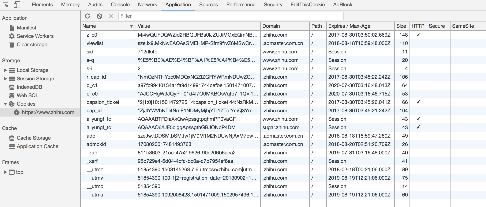

## 2.4　会话和 Cookies

在浏览网站的过程中，我们经常会遇到需要登录的情况，有些页面只有登录之后才可以访问，而且登录之后可以连续访问很多次网站，但是有时候过一段时间就需要重新登录。还有一些网站，在打开浏览器时就自动登录了，而且很长时间都不会失效，这种情况又是为什么？其实这里面涉及会话（Session）和 Cookies 的相关知识，本节就来揭开它们的神秘面纱。

### 2.4.1　静态网页和动态网页

在开始之前，我们需要先了解一下静态网页和动态网页的概念。这里还是前面的示例代码，内容如下：

```
<!DOCTYPE html>
<html>
<head>
<meta charset="UTF-8">
<title>This is a Demo</title>
</head>
<body>
<div id="container">
<div class="wrapper">
<h2 class="title">Hello World</h2>
<p class="text">Hello, this is a paragraph.</p>
</div>
</div>
</body>
</html>
```

这是最基本的 HTML 代码，我们将其保存为一个 .html 文件，然后把它放在某台具有固定公网 IP 的主机上，主机上装上 Apache 或 Nginx 等服务器，这样这台主机就可以作为服务器了，其他人便可以通过访问服务器看到这个页面，这就搭建了一个最简单的网站。

这种网页的内容是 HTML 代码编写的，文字、图片等内容均通过写好的 HTML 代码来指定，这种页面叫作静态网页。它加载速度快，编写简单，但是存在很大的缺陷，如可维护性差，不能根据 URL 灵活多变地显示内容等。例如，我们想要给这个网页的 URL 传入一个 name 参数，让其在网页中显示出来，是无法做到的。

因此，动态网页应运而生，它可以动态解析 URL 中参数的变化，关联数据库并动态呈现不同的页面内容，非常灵活多变。我们现在遇到的大多数网站都是动态网站，它们不再是一个简单的 HTML，而是可能由 JSP、PHP、Python 等语言编写的，其功能比静态网页强大和丰富太多了。

此外，动态网站还可以实现用户登录和注册的功能。再回到开头提到的问题，很多页面是需要登录之后才可以查看的。按照一般的逻辑来说，输入用户名和密码登录之后，肯定是拿到了一种类似凭证的东西，有了它，我们才能保持登录状态，才能访问登录之后才能看到的页面。

那么，这种神秘的凭证到底是什么呢？其实它就是会话和 Cookies 共同产生的结果，下面我们来一探究竟。

### 2.4.2　无状态 HTTP
在了解会话和 Cookies 之前，我们还需要了解  HTTP 的一个特点，叫作无状态。

HTTP 的无状态是指 HTTP 协议对事务处理是没有记忆能力的，也就是说服务器不知道客户端是什么状态。当我们向服务器发送请求后，服务器解析此请求，然后返回对应的响应，服务器负责完成这个过程，而且这个过程是完全独立的，服务器不会记录前后状态的变化，也就是缺少状态记录。这意味着如果后续需要处理前面的信息，则必须重传，这导致需要额外传递一些前面的重复请求，才能获取后续响应，然而这种效果显然不是我们想要的。为了保持前后状态，我们肯定不能将前面的请求全部重传一次，这太浪费资源了，对于这种需要用户登录的页面来说，更是棘手。

这时两个用于保持 HTTP 连接状态的技术就出现了，它们分别是会话和 Cookies。会话在服务端，也就是网站的服务器，用来保存用户的会话信息；Cookies 在客户端，也可以理解为浏览器端，有了 Cookies，浏览器在下次访问网页时会自动附带上它发送给服务器，服务器通过识别 Cookies 并鉴定出是哪个用户，然后再判断用户是否是登录状态，然后返回对应的响应。

我们可以理解为 Cookies 里面保存了登录的凭证，有了它，只需要在下次请求携带 Cookies 发送请求而不必重新输入用户名、密码等信息重新登录了。

因此在爬虫中，有时候处理需要登录才能访问的页面时，我们一般会直接将登录成功后获取的 Cookies 放在请求头里面直接请求，而不必重新模拟登录。

好了，了解会话和 Cookies 的概念之后，我们在来详细剖析它们的原理。

#### 1. 会话

会话，其本来的含义是指有始有终的一系列动作 / 消息。比如，打电话时，从拿起电话拨号到挂断电话这中间的一系列过程可以称为一个会话。

而在 Web 中，会话对象用来存储特定用户会话所需的属性及配置信息。这样，当用户在应用程序的 Web 页之间跳转时，存储在会话对象中的变量将不会丢失，而是在整个用户会话中一直存在下去。当用户请求来自应用程序的 Web 页时，如果该用户还没有会话，则 Web 服务器将自动创建一个会话对象。当会话过期或被放弃后，服务器将终止该会话。

#### 2. Cookies
Cookies 指某些网站为了辨别用户身份、进行会话跟踪而存储在用户本地终端上的数据。

##### 会话维持
那么，我们怎样利用 Cookies 保持状态呢？当客户端第一次请求服务器时，服务器会返回一个响应头中带有 Set-Cookie 字段的响应给客户端，用来标记是哪一个用户，客户端浏览器会把 Cookies 保存起来。当浏览器下一次再请求该网站时，浏览器会把此 Cookies 放到请求头一起提交给服务器，Cookies 携带了会话 ID 信息，服务器检查该 Cookies 即可找到对应的会话是什么，然后再判断会话来以此来辨认用户状态。

在成功登录某个网站时，服务器会告诉客户端设置哪些 Cookies 信息，在后续访问页面时客户端会把 Cookies 发送给服务器，服务器再找到对应的会话加以判断。如果会话中的某些设置登录状态的变量是有效的，那就证明用户处于登录状态，此时返回登录之后才可以查看的网页内容，浏览器再进行解析便可以看到了。

反之，如果传给服务器的 Cookies 是无效的，或者会话已经过期了，我们将不能继续访问页面，此时可能会收到错误的响应或者跳转到登录页面重新登录。

所以，Cookies 和会话需要配合，一个处于客户端，一个处于服务端，二者共同协作，就实现了登录会话控制。

##### 属性结构
接下来，我们来看看 Cookies 都有哪些内容。这里以知乎为例，在浏览器开发者工具中打开 Application 选项卡，然后在左侧会有一个 Storage 部分，最后一项即为 Cookies，将其点开，如图 2-13 所示，这些就是 Cookies。



图 2-13　Cookies 列表

可以看到，这里有很多条目，其中每个条目可以称为 Cookie。它有如下几个属性。

* Name，即该 Cookie 的名称。Cookie 一旦创建，名称便不可更改
* Value，即该 Cookie 的值。如果值为 Unicode 字符，需要为字符编码。如果值为二进制数据，则需要使用 BASE64 编码。
* Max Age，即该 Cookie 失效的时间，单位秒，也常和 Expires 一起使用，通过它可以计算出其有效时间。Max Age 如果为正数，则该 Cookie 在 Max Age 秒之后失效。如果为负数，则关闭浏览器时 Cookie 即失效，浏览器也不会以任何形式保存该 Cookie。
* Path，即该 Cookie 的使用路径。如果设置为 /path/，则只有路径为 /path/ 的页面可以访问该 Cookie。如果设置为 /，则本域名下的所有页面都可以访问该 Cookie。
* Domain，即可以访问该 Cookie 的域名。例如如果设置为 .zhihu.com，则所有以 zhihu.com，结尾的域名都可以访问该 Cookie。
* Size 字段，即此 Cookie 的大小。
* Http 字段，即 Cookie 的 httponly 属性。若此属性为 true，则只有在 HTTP Headers 中会带有此 Cookie 的信息，而不能通过 document.cookie 来访问此 Cookie。
* Secure，即该 Cookie 是否仅被使用安全协议传输。安全协议。安全协议有 HTTPS，SSL 等，在网络上传输数据之前先将数据加密。默认为 false。

##### 会话 Cookie 和持久 Cookie

从表面意思来说，会话 Cookie 就是把 Cookie 放在浏览器内存里，浏览器在关闭之后该 Cookie 即失效；持久 Cookie 则会保存到客户端的硬盘中，下次还可以继续使用，用于长久保持用户登录状态。

其实严格来说，没有会话 Cookie 和持久 Cookie 之 分，只是由 Cookie 的 Max Age 或 Expires 字段决定了过期的时间。

因此，一些持久化登录的网站其实就是把 Cookie 的有效时间和会话有效期设置得比较长，下次我们再访问页面时仍然携带之前的 Cookie，就可以直接保持登录状态。

### 2.4.3　常见误区

在谈论会话机制的时候，常常听到这样一种误解 ——“只要关闭浏览器，会话就消失了”。可以想象一下会员卡的例子，除非顾客主动对店家提出销卡，否则店家绝对不会轻易删除顾客的资料。对会话来说，也是一样，除非程序通知服务器删除一个会话，否则服务器会一直保留。比如，程序一般都是在我们做注销操作时才去删除会话。

但是当我们关闭浏览器时，浏览器不会主动在关闭之前通知服务器它将要关闭，所以服务器根本不会有机会知道浏览器已经关闭。之所以会有这种错觉，是因为大部分会话机制都使用会话 Cookie 来保存会话 ID 信息，而关闭浏览器后 Cookies 就消失了，再次连接服务器时，也就无法找到原来的会话了。如果服务器设置的 Cookies 保存到硬盘上，或者使用某种手段改写浏览器发出的 HTTP 请求头，把原来的 Cookies 发送给服务器，则再次打开浏览器，仍然能够找到原来的会话 ID，依旧还是可以保持登录状态的。

而且恰恰是由于关闭浏览器不会导致会话被删除，这就需要服务器为会话设置一个失效时间，当距离客户端上一次使用会话的时间超过这个失效时间时，服务器就可以认为客户端已经停止了活动，才会把会话删除以节省存储空间。

* Session 和几种状态保持方案理解：[http://www.mamicode.com/info-detail-46545.html](http://www.mamicode.com/info-detail-46545.html)